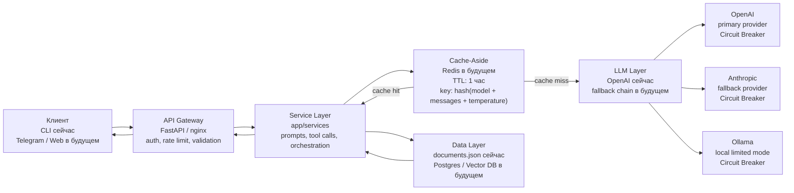

# Архитектурный паспорт проекта rag-document-assistant

## Назначение проекта

`rag-document-assistant` — учебный ИИ-ассистент для анализа юридических документов.

Пользователь задает вопрос о документах компании, ассистент обращается к LLM, при необходимости вызывает инструменты, ищет документ во внутренней базе и возвращает понятный ответ.

Сейчас проект находится на MVP-этапе:

- есть консольный запуск через `examples/run_tool_call.py`;
- есть LLM-сервис с циклом `tool_calls`;
- есть два инструмента: `search_documents` и `extract_key_fields`;
- данные пока хранятся в `data/documents.json`;
- структура проекта подготовлена под будущий FastAPI-сервис.

В следующих блоках проект можно расширять: добавить FastAPI, Telegram-бота, кеш, fallback-провайдеров, observability и полноценный RAG-поиск.

## Текущая структура проекта

```text
rag-document-assistant/
├── app/
│   ├── main.py                  # future FastAPI entry point
│   ├── core/
│   │   ├── config.py            # settings and environment variables
│   │   └── logging.py           # logging configuration
│   ├── deps/
│   │   └── providers.py         # future dependency providers
│   ├── routers/
│   │   ├── chat.py              # future chat endpoints
│   │   ├── health.py            # future health endpoints
│   │   └── models.py            # future model endpoints
│   ├── schemas/
│   │   ├── chat.py              # future chat schemas
│   │   ├── models.py            # future model schemas
│   │   └── tools.py             # JSON Schema for LLM tools
│   ├── services/
│   │   ├── llm.py               # LLM calls and tool call loop
│   │   └── tools.py             # Python handlers for tools
│   └── prompts/
│       ├── loader.py            # prompt loader
│       ├── system_v1.j2          # system prompt
│       └── tools/               # tool descriptions
├── data/
│   └── documents.json           # current document storage
├── examples/
│   └── run_tool_call.py          # console test run
├── tests/
├── README.md
└── assistant.log
```

## Целевые параметры нагрузки

Так как проект находится на учебном MVP-этапе, точные production-метрики пока не измерялись. Для архитектурного планирования принимаются ориентировочные значения:

- 5-10 запросов в минуту в обычном учебном режиме;
- до 30 запросов в минуту в пиковом режиме;
- средний ответ: 200-500 токенов;
- среднее время ответа LLM: 2-8 секунд;
- примерный бюджет: до $1 в день на этапе MVP;
- целевой cache hit rate: 20-30% для повторяющихся вопросов по одним и тем же документам.

## Диаграмма архитектуры



## Поток одного запроса

1. Пользователь задает вопрос о юридическом документе.
2. Сейчас запрос попадает в проект через `examples/run_tool_call.py`; в будущем он будет приходить через FastAPI Gateway.
3. Service Layer вызывает `ask_assistant` из `app/services/llm.py`.
4. LLM-сервис собирает system prompt и сообщение пользователя.
5. Запрос отправляется в OpenAI вместе с JSON Schema доступных tools.
6. Если модель решила вызвать tool, Service Layer запускает нужную Python-функцию из `app/services/tools.py`.
7. Tool читает данные из `data/documents.json`.
8. Результат tool возвращается модели.
9. Модель формирует финальный ответ.
10. Ответ возвращается пользователю.

## ADR-001: Выбор паттерна взаимодействия

**Status:** Accepted

**Context.** Проект — ассистент для анализа юридических документов. Сейчас он работает как консольное MVP-приложение, в будущем будет подключен к FastAPI и Telegram-боту. Основной сценарий — пользователь задает вопрос о документе, ассистент ищет подходящие документы, извлекает ключевые поля и формирует короткий ответ. Ожидаемая нагрузка на этапе MVP — 5-10 RPM, в пике до 30 RPM. Средний ответ — 200-500 токенов, среднее время генерации — 2-8 секунд.

**Decision.** На текущем этапе выбран паттерн **Request-Response**. Он подходит для коротких и средних ответов, проще реализуется и хорошо сочетается с Function Calling. Пользователь отправляет запрос и получает готовый ответ после завершения всех tool calls и LLM-вызова.

**Consequences.** Плюсы: простая архитектура, меньше инфраструктуры, проще тестировать prompts, tools и LLM-цикл. Минусы: пользователь ждет финальный ответ без промежуточного отображения токенов. При переходе к Telegram или Web-интерфейсу для длинных ответов можно добавить Streaming.

**Alternatives considered.** Streaming не выбран на текущем этапе, потому что консольный MVP и короткие ответы не требуют отображения токенов в реальном времени. Queue-based не выбран, потому что пока нет batch-обработки больших объемов документов и фоновых задач.

## ADR-002: Стратегия fault tolerance

**Status:** Accepted

**Context.** LLM API может быть медленным, дорогим и нестабильным. Возможны ошибки 429, 500, 503, timeout, а также временная недоступность основного провайдера. Для юридического ассистента важно не падать полностью, а деградировать предсказуемо.

**Decision.** Основной провайдер — OpenAI, потому что текущий проект уже использует OpenAI SDK и Function Calling. Fallback-провайдер — Anthropic как резервный облачный LLM-провайдер. Третий уровень fallback — Ollama локально, для ограниченного режима работы при недоступности облачных провайдеров. Для каждого провайдера планируется отдельный Circuit Breaker. Перед LLM-слоем в будущей версии планируется Cache-Aside в Redis с TTL 1 час. Ключ кеша: `sha256(model + messages + temperature)`.

**Consequences.** Сервис сможет продолжать работу при сбоях основного провайдера. Кеш снизит стоимость и задержку для повторяющихся запросов. Архитектура станет сложнее: появятся retry, circuit breaker, fallback chain и внешний кеш.

**Alternatives considered.** Один OpenAI-провайдер без fallback отвергнут, потому что падение провайдера полностью остановит сервис. Только локальная модель отвергнута, потому что качество ответов и поддержка function calling могут быть слабее, чем у облачных моделей.

## Потенциальные точки отказа

| Слой | Что может сломаться | Что произойдет | Паттерн защиты | Graceful degradation |
|---|---|---|---|---|
| API Gateway | FastAPI или nginx недоступен | Пользователь не сможет отправить запрос | healthcheck, restart policy, rate limit | показать сообщение о временной недоступности |
| Service Layer | ошибка в prompts, orchestration или tools | запрос обработается некорректно | логирование, тесты, обработка исключений | вернуть короткий безопасный ответ |
| LLM Layer | OpenAI недоступен или отвечает 429/503 | модель не сможет сгенерировать ответ через primary | fallback chain, retry, Circuit Breaker | перейти на Anthropic, затем на Ollama |
| Data Layer | `documents.json`, Postgres или Vector DB недоступны | ассистент не сможет найти документы | обработка ошибок, резервное хранилище | ответить, что поиск по документам временно недоступен |
| Cache | Redis недоступен | вырастет latency и стоимость запросов | Cache-Aside допускает cache miss | продолжить работу напрямую через LLM |

## Архитектурные паттерны

### Request-Response

Основной паттерн текущего MVP. Один пользовательский запрос проходит полный цикл обработки и возвращает один финальный ответ.

### Cache-Aside

Планируется перед LLM-вызовом. Если ответ уже есть в кеше, сервис возвращает его без обращения к LLM. Если ответа нет, сервис вызывает LLM и сохраняет результат.

Плановые параметры:

- хранилище: Redis;
- TTL: 1 час;
- ключ: `sha256(model + messages + temperature)`;
- кешировать только запросы с `temperature=0`.

### Circuit Breaker

Circuit Breaker планируется отдельно для каждого LLM-провайдера:

- OpenAI Circuit Breaker;
- Anthropic Circuit Breaker;
- Ollama Circuit Breaker.

Пример параметров:

- `fail_max = 5`;
- `timeout = 60s`;
- отслеживаемые ошибки: timeout, 429, 500, 503.

### Fallback Chain

Плановый порядок fallback:

1. OpenAI — основной провайдер, потому что уже используется в проекте и поддерживает Function Calling.
2. Anthropic — резервный облачный провайдер.
3. Ollama — локальный fallback для ограниченного режима.

Если OpenAI недоступен, запрос переключается на Anthropic. Если оба облачных провайдера недоступны, сервис может использовать локальную модель Ollama и предупредить пользователя, что работает в ограниченном режиме.

## LiteLLM

LiteLLM можно использовать как готовый LLM Gateway. Он позволяет обращаться к разным LLM-провайдерам через единый OpenAI-compatible API.

Для проекта `rag-document-assistant` LiteLLM полезен тем, что поддерживает:

- fallback chains;
- routing между моделями;
- retries;
- rate limits;
- cost tracking;
- единый endpoint для разных провайдеров.

На текущем учебном этапе проект сохраняет собственный минимальный LLM-слой, чтобы было понятно, как устроены Function Calling, fallback и обработка ошибок. В production-версии LiteLLM можно вынести перед LLM Layer и заменить прямой вызов OpenAI SDK на обращение к LiteLLM proxy.

Пример будущего подключения:

```python
client = OpenAI(
    base_url="http://localhost:4000/v1",
    api_key="anything",
)
```

## Пример config.yaml для LiteLLM

Файл для будущей проверки: `docs/litellm/config.yaml`.

```yaml
model_list:
  - model_name: legal-assistant-primary
    litellm_params:
      model: openai/gpt-4o-mini
      api_key: os.environ/OPENAI_API_KEY

  - model_name: legal-assistant-fallback
    litellm_params:
      model: anthropic/claude-3-5-sonnet-latest
      api_key: os.environ/ANTHROPIC_API_KEY

router_settings:
  fallbacks:
    - legal-assistant-primary:
        - legal-assistant-fallback

litellm_settings:
  num_retries: 2
  request_timeout: 30
  drop_params: true
```
